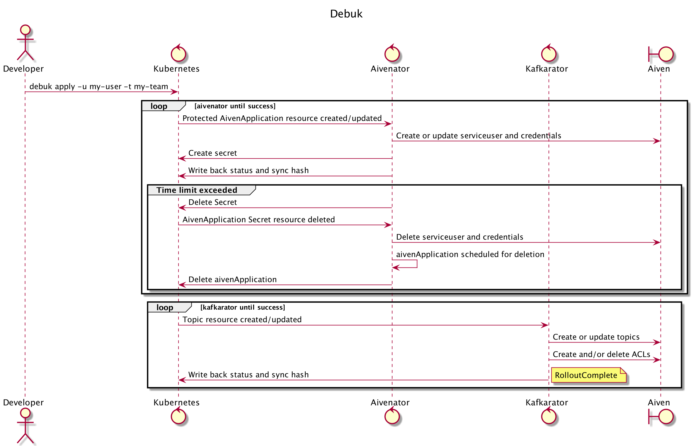

# debuk

An Aiven Kafka Debug Cli to apply a `aivenApplication` and extract its credentials. The tool will apply
an [Protected](https://doc.nais.io/persistence/kafka/#accessing-topics-from-an-application-on-legacy-infrastructure) `aivenApplication`
in your specified namespace=`team`. This will give access to personal but time limited credential. This credential can
be used to debug an Aiven hosted kafka topic. **Debuk** extracts the fresh `aivenApplication` credentials and
puts them in `current` folder. The applied `aivenApplication` has a default for `timeToLive` and is set to 1 day.

## Prerequisite

* Authentication & Authorization
    * Connect to [naisdevice](https://doc.nais.io/device/)
    * Tool is used in GCP? please be sure to log in:

```
gcloud auth login --update-adc
```

* Update your [topic](https://doc.nais.io/persistence/kafka/#creating-topics-and-defining-access) resource & ACLs
    * Add `username` to your `Topic`.yaml ACLs and apply to your namespace.


* Install [kafkacat](https://github.com/edenhill/kcat) in preferred way.

## Use

First;

```
brew tap nais/tap
```

then;

```
brew install debuk  
```


check;

```
make debuk version
```

You should be able to use command;

```
debuk [commands] [flags]
```

Available commands:

- apply

For help on individual commands, add `--help` following the command name.

### Flags

Flags provide modifiers to control how the action command operates.

#### Required

* `--username`
    * short `-u`: Prefix before `@nav.no`.

* `--team`
    * short `-t`: teamnamespace (default not supported).

### Optional

* `--pool`
    * short `-p` default `nav-dev`: Preferred kafka pool.

* `--expire`
    * short `-e` default `1`: Time in days the created secret should be valid.

* `--dest`
    * short `-d` default `current`: Path to directory where secrets will be dropped of. For current with a new folder,
      e.g: `/creds`

* `--secret-name`
    * short `-s` default `namespace-username-(random-id)`: Preferred secret-name instead of the generated.

## Available files

After successful `debuk` command a set of files will be available in `current` folder.

- client-keystore.p12
- client-truststore.jks
- `username`.yaml (the yaml applied to specified namespace)
- kafka-ca.cert
- kafka-certificate.crt
- kafka-private-key.pem
- kafka-schema-registry.env
- kafkacat.config

### Examples files

#### `username`.yaml

```yaml
apiVersion: aiven.nais.io/v1
kind: AivenApplication
metadata:
  name: my-user
  namespace: my-namespace
spec:
  secretName: default-my-user-d1037d
  protected: true
  kafka:
    pool: nav-dev
  userSpec:
    timeToLive: 1
```

#### kafkacat.config

```Properties
# Debuked 2021-09-01 15:26:00
# kafkacat -F kafkacat.config
ssl.key.location=/path/to/current/folder/creds/my-username-kafka-private-key.pem
ssl.certificate.location=/path/to/current/folder/creds/my-username-kafka-certificate.crt
ssl.key.password=changeme
bootstrap.servers=https://boostrap-server.aivencloud.com:26484
ssl.ca.location=/path/to/current/folder/creds/my-user-kafka-ca.cert
security.protocol=ssl
```

`kafkacat.config` can be used with [aiven-kafkacat](https://help.aiven.io/en/articles/2607674-using-kafkacat) to
authenticate against the Aiven hosted topics in GCP.

You can refer to this config with -F flag:

```
kafkacat -F kafkacat.config
```

Alternatively, you can specify the same settings directly on the command line:

```
kafkacat \
    -b https://boostrap-server.aivencloud.com:26484 \
    -X security.protocol=ssl \
    -X ssl.key.location=service.key \
    -X ssl.certificate.location=service.cert \
    -X ssl.ca.location=ca.pem
```

For more details [aiven-kafkacat-help](https://help.aiven.io/en/articles/2607674-using-kafkacat)

#### kafka-schema-registry.env

```Properties
KAFKA_SCHEMA_REGISTRY_USER:my-team.my-user-cq3bvnum
KAFKA_SCHEMA_REGISTRY:https://bootstrap-server.aivencloud.com:26487
KAFKA_SCHEMA_REGISTRY_PASSWORD:password
```

## Flow


